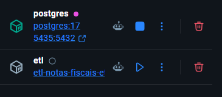
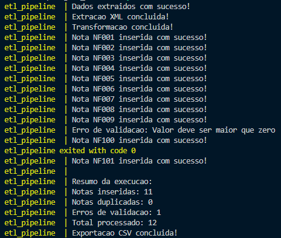
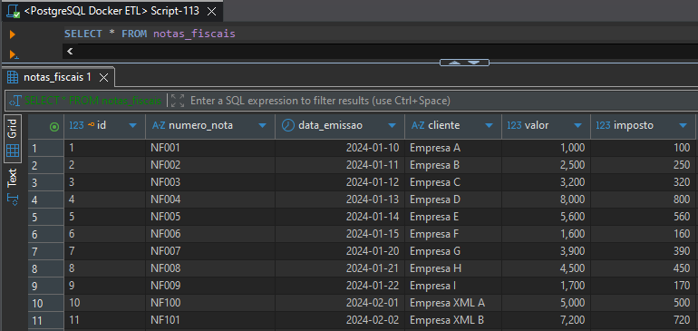
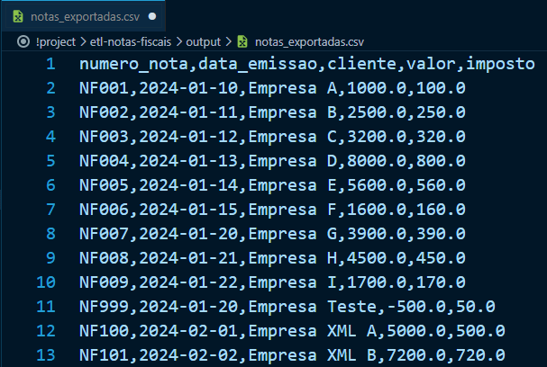

# 🚀 ETL de Notas Fiscais com Python, PostgreSQL e Docker

Projeto desenvolvido com foco em Engenharia de Dados, implementando um pipeline ETL (Extract, Transform, Load) para processamento de notas fiscais em formatos JSON e XML, com validação de dados, persistência em PostgreSQL, exportação para CSV e execução containerizada com Docker.

---

## 📌 Objetivo

Este projeto simula um fluxo real de engenharia de dados, realizando:

- Extração de dados a partir de arquivos JSON e XML;
- Transformação e padronização dos registros;
- Validação das informações;
- Tratamento de duplicidades;
- Carga dos dados em PostgreSQL;
- Exportação dos dados para CSV;
- Geração de logs;
- Estatísticas da execução do pipeline;
- Execução via Docker Compose.

---

## 🏗 Arquitetura do Projeto

```text
JSON / XML
     │
     ▼
  Extract
     │
     ▼
 Transform
     │
     ▼
 Validate
     │
     ▼
    Load
     │
     ▼
 PostgreSQL
     │
     ▼
 CSV Export
```

---

## 📸 Evidências do Projeto

### Estrutura do Projeto


---

### Containers Docker



---

### Execução do Pipeline



---

### Dados no PostgreSQL



---

### Arquivo CSV Gerado



---

## 🛠 Tecnologias Utilizadas

| Tecnologia | Finalidade |
|------------|------------|
| Python 3 | Desenvolvimento do ETL |
| PostgreSQL 17 | Persistência dos dados |
| Docker | Containerização |
| Docker Compose | Orquestração dos containers |
| Psycopg2 | Integração Python + PostgreSQL |
| Python Dotenv | Variáveis de ambiente |
| JSON | Fonte de dados |
| XML | Fonte de dados |
| CSV | Exportação dos resultados |

---

## 📂 Estrutura do Projeto

```text
etl-notas-fiscais/
│
├── assets/
│   ├── project-structure.png
│   ├── docker-containers.png
│   ├── etl-execution.png
│   ├── database-results.png
│   └── csv-output.png
│
├── data/
│   ├── notas.json
│   └── notas.xml
│
├── logs/
│   └── etl.log
│
├── output/
│   └── notas_exportadas.csv
│
├── sql/
│   └── init.sql
│
├── src/
│   ├── main.py
│   ├── extract.py
│   ├── extract_xml.py
│   ├── extract_csv.py
│   ├── transform.py
│   ├── validator.py
│   ├── load.py
│   ├── export.py
│   └── logger.py
│
│
├── .env
├── .dockerignore
├── .gitignore
├── docker-compose.yml
├── Dockerfile
├── requirements.txt
└── README.md
```

---

## 🔄 Fluxo de Execução

O pipeline executa as seguintes etapas:

### 1️⃣ Extract

Leitura dos arquivos:

- JSON
- XML

Conversão para estrutura manipulável pelo Python.

---

### 2️⃣ Transform

Padronização dos dados:

- Conversão de tipos;
- Conversão para tuplas;
- Tratamento de registros inválidos.

---

### 3️⃣ Validate

Validação das regras de negócio:

- Número da nota obrigatório;
- Cliente obrigatório;
- Valor maior que zero;
- Imposto não negativo;
- Data válida.

---

### 4️⃣ Load

Inserção dos dados no PostgreSQL.

Validações adicionais:

- Verificação de duplicidade;
- Controle de erros;
- Registro de logs.

---

### 5️⃣ Export

Exportação automática dos dados processados para CSV.

---

## 📊 Estatísticas da Execução

Ao final do processamento o sistema apresenta:

- Total processado;
- Registros inseridos;
- Registros duplicados;
- Erros de validação.

Exemplo:

```text
Resumo da execução:

Notas inseridas: 9
Notas duplicadas: 0
Erros de validação: 1
Total processado: 10
```

---

## 🐳 Executando o Projeto

### 1. Clonar o repositório

```bash
git clone https://github.com/VictorWhile/etl-notas-fiscais.git
```

```bash
cd etl-notas-fiscais
```

---

### 2. Configurar variáveis de ambiente

Criar arquivo `.env`

```env
DB_HOST=postgres
DB_PORT=5432
DB_NAME=etl_notas
DB_USER=postgres
DB_PASSWORD=postgres
```

---

### 3. Executar com Docker

```bash
docker compose up --build
```

---

### 4. Derrubar containers

```bash
docker compose down
```

---

### 5. Remover containers e volumes

```bash
docker compose down -v
```

---

## 🗄 Banco de Dados

Tabela criada automaticamente:

```sql
CREATE TABLE notas_fiscais (
    id SERIAL PRIMARY KEY,
    numero_nota VARCHAR(50) UNIQUE,
    data_emissao DATE,
    cliente VARCHAR(255),
    valor NUMERIC(10,2),
    imposto NUMERIC(10,2)
);
```

---

## 🔍 Consultando os Dados

Conecte-se ao PostgreSQL:

```text
Host: localhost
Porta: 5434
Banco: etl_notas
Usuário: postgres
Senha: postgres
```

Consulta:

```sql
SELECT * FROM notas_fiscais;
```

---

## 📄 Exportação CSV

Após a execução do pipeline, os registros são exportados automaticamente para:

```text
output/notas_exportadas.csv
```

---

## 📈 Funcionalidades Implementadas

- ✅ Processamento de JSON
- ✅ Processamento de XML
- ✅ ETL modularizado
- ✅ Validação de dados
- ✅ Tratamento de erros
- ✅ Controle de duplicidade
- ✅ Logs de execução
- ✅ Estatísticas do pipeline
- ✅ Exportação CSV
- ✅ PostgreSQL
- ✅ Docker
- ✅ Docker Compose
- ✅ Healthcheck
- ✅ Persistência de dados

---

## 🚧 Roadmap

Próximas melhorias planejadas:

- [ ] Testes automatizados com Pytest
- [ ] Apache Airflow
- [ ] Dashboard com Streamlit
- [ ] CI/CD com GitHub Actions
- [ ] Deploy em AWS
- [ ] Monitoramento do pipeline

---

## 👨‍💻 Autor

### Victor Schmitt Rothmann

Tecnólogo em Análise e Desenvolvimento de Sistemas.

Projeto desenvolvido para estudo de:

- Engenharia de Dados
- Python
- PostgreSQL
- Docker
- ETL
- Boas práticas de desenvolvimento

---

⭐ Caso tenha gostado do projeto, considere deixar uma estrela no repositório.