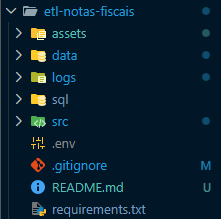
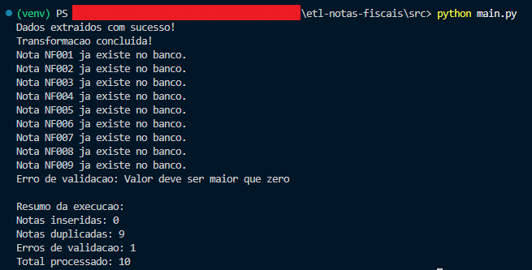
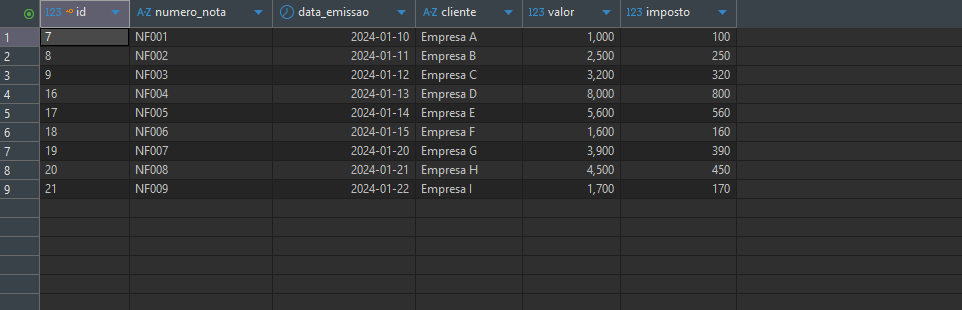

# ETL de Notas Fiscais com Python e PostgreSQL

Projeto de ETL desenvolvido com Python e PostgreSQL para simular o processamento de notas fiscais em um pipeline de dados.

O projeto realiza:

- Extração de dados JSON
- Transformação e padronização dos dados
- Validação de regras de negócio
- Controle de duplicidade
- Inserção no PostgreSQL
- Geração de logs
- Resumo de execução do pipeline

---

# Tecnologias Utilizadas

- Python
- PostgreSQL
- psycopg2
- SQL
- JSON
- DBeaver
- PGAdmin
- Git e GitHub
- python-dotenv

---

# Estrutura do Projeto



---

# Fluxo do Pipeline

1. Extração dos dados JSON
2. Transformação dos dados
3. Validação das informações
4. Verificação de duplicidade
5. Inserção no banco de dados
6. Geração de logs e métricas

---

# Execução do Pipeline



---

# Dados no PostgreSQL



---

# Funcionalidades Implementadas

## Extração de Dados
Leitura de arquivos JSON contendo notas fiscais.

## Transformação de Dados
Conversão e padronização dos dados para inserção no banco.

## Validação de Dados
Validação de:
- Valores negativos
- Campos vazios
- Datas inválidas

## Controle de Duplicidade
Validação para impedir inserção de notas fiscais já existentes no banco.

## Logging
Geração de logs de execução do pipeline.

## Métricas do Pipeline
Resumo contendo:
- Notas inseridas
- Notas duplicadas
- Erros de validação
- Total processado

---

# Como Executar o Projeto

## Clonar repositório

```bash
git clone https://github.com/VictorWhile/etl-notas-fiscais.git
```

---

## Criar ambiente virtual

```bash
python -m venv venv
```

---

## Ativar ambiente virtual

### Windows

```bash
venv\Scripts\activate
```

---

## Instalar dependências

```bash
pip install -r requirements.txt
```

---

## Executar projeto

```bash
cd src

python main.py
```

---

# Melhorias Futuras

- Leitura de XML
- Docker
- Exportação CSV
- Integração com APIs
- Dashboard de métricas
- Orquestração com Airflow

---

# Autor

Victor Rothmann

GitHub:
https://github.com/VictorWhile

LinkedIn:
https://www.linkedin.com/in/victor-rothmann-dev/